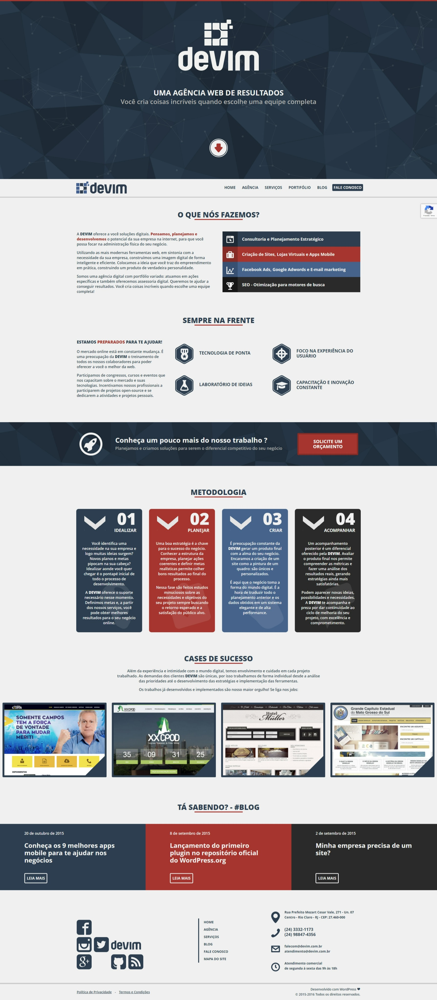

# **Site Wordpress - Agência Devim - 2013**

## **Overview**
A **Devim** foi um iniciativa do ano de 2013 para levar ao interior do Rio de Janeiro um conjunto de soluções e serviços digitais. A proposta era a de potencializar pequenos negócios na internet deixando o proprietário tranquilo com sua marca.

| [Demonstração](http://www.devim.com.br) |
|:---------------------------------------:|

- Esse projeto não aceita mais modificaçãoes
- **Inicio:** 26/09/2013  
- **Versão:** Discontinuada - Pré 2020  
- **Licença:** Proprietária - Uso Privado 

Todos os direitos reservados - A cópia não autorizada de qualquer arquivo deste projeto, por qualquer meio, é estritamente proibida.  

 

## **Usando**  
Para facilitar a utilização e iniciação do projeto foi crado o arquivo python `projetct.py`. Através dele é possível inciar, popular e interromper o projeto.

- Install - `py project.py install`
- Import - `py project.py idata`
- Export - `py project.py edata`
- Uninstall - `py project.py uninstall`

Outros comando podem ser fornecidos: `py project.py --help`
Acesso ao container wp-cli - `docker-compose run --rm cli sh`
Acesso ao container wordpress - `docker-compose exec wordpress bash`

 

## **Deploy**
- **Deploybot URL:** <https://devim.deploybot.com/>
- **Deploybot Credentials:** miguel.sneto@devim.com.br

 

## **Screenshot**

